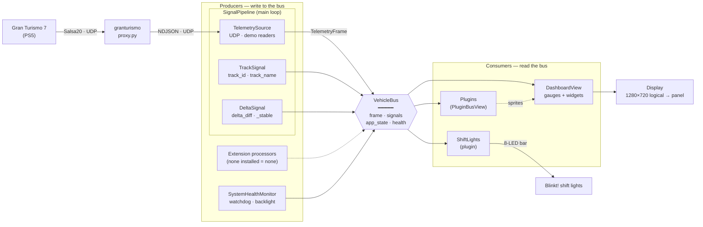

# CLAUDE.md

This file provides guidance to Claude Code (claude.ai/code) when working with code in this repository.

## About

An embedded sim racing instrument cluster built with Python/pygame. Runs on Raspberry Pi 4/5 with a supported DSI touch display (Raspberry Pi Touch Display 2 at 720×1280, or the Waveshare 5″ DSI at 800×480 — see the profiles in `peripherals/display.py`). Renders a real-time dashboard at 60 fps from telemetry delivered as NDJSON to `udp://127.0.0.1:5600`.

The cluster is **game-agnostic**: it only ever reads that localhost NDJSON. Each supported game is a separately-released **feed program** the user installs, which reads the game's telemetry and re-emits the `TelemetryFrame` schema. GT7 uses the [granturismo](https://github.com/chrshdl/granturismo) proxy (decrypts GT7's Salsa20 UDP stream); Assetto Corsa Competizione uses a feed over its native UDP Broadcasting API. The feeds are listed as data in `addons/feeds.py` (`FeedDescriptor`s); the install flow, settings UI, and IP-entry are generic over a descriptor — there is no per-game branching in the runtime. A feed may set two optional `TelemetryFrame` fields, `native_delta_ms` and `track_name`, which `DeltaSignal`/`TrackSignal` republish instead of computing (ACC provides both; GT7 leaves them unset and the GT7 compute paths run).

## Commands

```bash
# Install deps and activate venv
uv venv && source .venv/bin/activate && uv sync

# Run the app (defaults to demo mode — no PS5 required)
python -m instrument_cluster

# Run tests
uv run pytest

# Run a single test file
uv run pytest tests/instrument_cluster/core/plugin_system/test_plugin_manager.py

# Run tests with coverage
uv run pytest --cov=instrument_cluster
```

**Config location**: `~/.config/instrument-cluster/config.json` (or override with `IC_CONFIG_PATH` env var).

## Deployment to the Pi

The Pi (`root@instrument-cluster.local`) runs the package as bytecode-only (`.pyc`, no source). **Always ssh/scp as `root@instrument-cluster.local`** — never a numeric IP. The DHCP address drifts on its own (observed .79 → .81 → .83 within a week), not just on image flashes, so any remembered IP is assumed stale. (A re-flash also regenerates the SSH host key; remove the stale entry with `ssh-keygen -R instrument-cluster.local` when ssh complains.) To push a change:

```bash
# 1. Compile the changed module(s) — strip the cpython-3XX infix so the
#    filename matches what's already on the Pi.
python3 -c "import py_compile; py_compile.compile('src/instrument_cluster/signals/delta_signal.py', cfile='/tmp/delta_signal.pyc', doraise=True)"

# 2. Make the read-only rootfs writable, then copy to the Pi (mirror the
#    package subdirectory structure)
ssh root@instrument-cluster.local "mount -o remount,rw /"
scp /tmp/delta_signal.pyc root@instrument-cluster.local:/usr/lib/python3.12/site-packages/instrument_cluster/signals/delta_signal.pyc

# 3. Restore read-only and restart. The remount,ro must happen while the
#    service is stopped — a running cluster pins the rootfs writable via a
#    shared-writable mmap of mesa's GPU shader cache.
ssh root@instrument-cluster.local "systemctl stop instrument-cluster; sync; mount -o remount,ro /; systemctl start instrument-cluster; sleep 2; systemctl is-active instrument-cluster"
```

The install root is `/usr/lib/python3.12/site-packages/instrument_cluster/`. Subdirectories (`signals/`, `ui/`, etc.) mirror `src/instrument_cluster/`. The local Python used to compile must be 3.12 to match the Pi's interpreter.

## Architecture

### Data Flow

The system is a **blackboard**: a 60 fps main loop (`main.py`) drives producers that write to `VehicleBus` and consumers that read from it. All signal processors run directly from the main loop — `SignalPipeline` (which bundles `TelemetrySource`, `TrackSignal`, and `DeltaSignal`) alongside the health monitor and any extension-registered signal processors (see Extensions below; none on the community image) — so the data-acquisition layer is never paused by UI state changes. `DashboardState` is a pure consumer: it only updates the view and peripherals. `VehicleBus.tick()` only updates `health`.



**`VehicleBus`** (`core/vehicle/vehicle_bus.py`) is the central shared data structure passed to everything:
- `.frame` — raw `TelemetryFrame` from GT7 (speed, RPM, gear, tire temps, position, flags, etc.)
- `.signals` — computed dict values from signal processors (e.g. `delta_diff`, `track_id`, `track_name`)
- `.app_state` — UI-level state (e.g. `delta_color`)
- `.health` — `SystemHealthMonitor` for systemd watchdog / backlight control

### Signal Processors

Signals in `signals/` enrich telemetry before the UI sees it. Each returns a dict that is merged into `VehicleBus.signals`. All signal processors are driven directly by the main loop — never by a UI state — so the data-acquisition layer continues uninterrupted even when settings menus are open.

- **`LinkSignal`** — telemetry link supervision. Readers hold their last frame forever (there is no TTL on `UdpJsonlReader._latest`), so this is what stops a sleeping console / crashed feed / dropped Wi-Fi from leaving frozen values on screen looking live. Publishes `telemetry_stale` + `telemetry_age_s`, measured off `received_time`, which the **reader** stamps on arrival (feeds must not — the schema's 0.0 default previously let a conforming feed silently kill the delta and fuel signals forever). Threshold 1 s, relaxed to 10 s while `paused`/`loading_or_processing`. Runs *before* the pipeline's no-frame guard so an inert reader is reported rather than shown as a blank dash. `NoSignalWindow` raises a full-width NO SIGNAL banner on it (gauges keep their last values at full brightness — dimming was tried and dropped as it only hurt legibility).
- **`SignalPipeline`** — main-loop owner of `TelemetrySource`, `TrackSignal`, `DeltaSignal`, `FuelSignal`, and `LinkSignal`. Its `update(bus, dt)` is called every frame before `state_manager.update()`. `start()` / `stop()` are called by `DashboardState.enter()` / `exit()`; an `_active` guard makes it a no-op when the dashboard is not in the stack. `sync_mode()` handles telemetry-mode switches on dashboard resume.
- **`DeltaSignal`** — wraps a Cython/fallback delta calculator. Publishes `delta_diff` (raw, 60 Hz) and `delta_diff_stable` (sample-and-hold with 200 ms refresh + 20 ms hysteresis for display). Resets on lap change and track change. Also publishes `delta_state` — why there is *no* delta, in GT3-dash vocabulary the widget shows in place of the number: `BEACON` (not in a timed lap), `REF_LAP` (recording the first reference), `NO_REF` (an established reference was discarded — distinct from never having had one). `None` means armed. The widget must never hold the previous number when the signal goes None: a delta from an earlier lap, reference or track is indistinguishable from a live one. Note the delta is legitimately unavailable for the first ~3 laps of a session (lap 1's reference is discarded by `_skip_first_reference`, lap 2 builds it, lap 3 uses it) — the state words are what make that wait legible instead of looking broken. Changing the diff reference mode in settings takes effect mid-lap: the calculator (`delta-calculator` ≥ 0.2.0) keeps previous-lap and fastest-lap references side by side and swaps the active one, and `DeltaSignal` republishes `delta_ref_lap_time` and force-refreshes the stable display on the switch.
- **`TrackSignal`** — identifies the current track from `db/tracks.json` and never revises a published name: it shows `---` until the evidence is conclusive. A track is recognized when the car's path exactly crosses a start/finish gate segment (direction-matched) *and* that crossing coincides with a `lap_count` tick — GT7 increments the counter exactly at the true line, which is what rejects mid-lap crossings of other layouts' lines (a Nürburgring 24h lap drives across the Nordschleife and Tourist layouts' gates). Gate-sharing siblings (Brands Hatch GP/Indy, Suzuka/East, …) stay unpublished while the lap decides: candidates are eliminated when the car escapes their bounding box, and a full line-to-line lap is fitted against the survivors' boxes. Six pairs have near-identical boxes and are geometrically unresolvable, picked by best fit: Spa / Spa 24h Layout, Le Mans / No Chicane, Daytona Tri-Oval / Road Course, Fuji / Fuji Short, Monza / No Chicane, and Barcelona-Catalunya GP / No Chicane. Publishes `track_id` and `track_name`. Locks once identified; a loading/processing blip (track/replay load) clears the lock so a newly loaded circuit is re-identified from scratch.
### State Machine

`StateManager` maintains a **stack** of `State` objects. Pushing a state pauses (but doesn't exit) the one below; popping resumes it. The `draw()` path uses dirty-rect rendering — only changed regions are flushed to display each frame.

### Window Layering

The main loop drives a `WindowManager` compositor (`ui/window_layering.py`), not the StateManager directly. The StateManager is the **BASE** layer; `OverlayWindow`s (z-ordered `WindowLayer`: NOTIFICATION, SYSTEM_ALERT topmost) are composited after it every frame — re-blitted whenever a base dirty rect touches them — so the base keeps running live underneath and no widget can ever draw over an overlay (sprite groups can't guarantee that; separate `LayeredDirty` groups only z-order sprites that repaint in the same frame). Overlay windows get events before the base and their disappearance triggers a base repaint. The community build registers two overlay windows itself, both in `main.py`: `NoSignalWindow` (`ui/no_signal_window.py`) on SYSTEM_ALERT, and `FeedUpdateWindow` (`ui/feed_update_window.py`) on NOTIFICATION — the stale-feed notice, shown once per boot and dismissed with a tap (it dims the live view 35% via `ui/widgets/base/modal_dimming.py::ModalDimming`, which states dim strength as a percentage rather than the raw alpha `ModalBackdrop` takes). `NoSignalWindow` is on SYSTEM_ALERT because a dead link — telemetry link loss must never be drawn over, which is precisely what that layer guarantees, and the compositor also repaints the base when it disappears. Extensions add their own notification popups via the extension runtime. Both are gated on a duck-typed opt-in the active state sets: `allows_notification_popup` for popups, `allows_system_alert` for the alert (both `DashboardState`-only, so Setup — where a dead feed is configured — is never covered).

Layers settle *pixels*; whether two windows may be up at once is arbitrated separately by `WindowManager._arbitrate()`, modelled on AAOS's `OverlayViewGlobalStateController`: the topmost visible window owns the policy, and a window it occludes is **withdrawn** — not composited, no events — rather than merely covered. Two class-attr opt-ins express it, both default off: `occludes_below` (suppress everything under me) and `show_when_occluded` (I survive someone else's occlusion). Only the *topmost* window is asked whether it occludes, so a NOTIFICATION can never suppress a SYSTEM_ALERT. Arbitration is stateless and recomputed every frame, so withdrawal is a deferral and never a dismissal — the window returns by itself when the occluder goes, and the compositor repaints the base on withdrawal exactly as it does when a window hides itself. A window therefore has two notions of being up: `visible` (its own request) and `showing` (what survived arbitration); anything that must match the pixels — compositing, event routing, dirty-sprite rising edges — keys off `showing`. `NoSignalWindow` declares `occludes_below`: a dead link is read alone, and it otherwise sliced across `FeedUpdateWindow`'s card while that card's 35% dimming knocked back the very gauges the banner marks as stale. The remedy stays reachable — the banner clears the footer, so the Setup button and its "Telemetry (update)" row are still there. `tools/preview_window_arbitration.py` walks both transitions on the panel and can toggle arbitration off to show the collision it fixes.

Key states in `states/`:
- `DashboardState` — the main racing view; a pure consumer that links plugin sprites into `DashboardView.plugin_layer` and re-links whenever `PluginManager.generation` changes (plugin reload). The view itself owns only chrome (Setup button, bezel LED strips). Signal processing is handled by `SignalPipeline` in the main loop, not here.
- `SetupState` — first-run / connection setup; renders extra rows contributed by extensions (none installed = none shown)
- `EnterIPState` — PS5 IP entry via soft keyboard

### Extensions (`extensions.py`)

**The base build is complete and fully offline** — no backend traffic of any kind; every widget is free. At startup `main.py` calls `extensions.runtime.load(...)`, which discovers installed add-on distributions via the **`instrument_cluster.extensions` entry-point group** and calls each registered `wire(runtime)` hook. No installed extensions is the silent default; a broken one logs, has its registrations rolled back, and the app degrades to the plain cluster. The community source never names any particular extension — proprietary add-ons ship as their own distributions (in their own OS image) declaring `my_extension = "my_package:wire"` like anything else. Inside `wire(runtime)` an extension registers:

- **signal processors** (`runtime.add_signal_processor`) — `update() -> dict` polled every frame into `bus.signals`, `stop()` at shutdown;
- **Setup rows** (`runtime.add_setup_entry(SetupEntry(...))`) — the entry's `make_state(state_manager)` builds the target state, its pygame event types are allocated once at registration, and `button_text` may be a callable (re-evaluated per Setup entry, so the label can track extension state);
- **overlay windows** — straight onto `runtime.window_manager`;
- **plugin classes** — appended to `plugin_manager.contributed_classes`, ranked between packaged and external (an external file can still shadow one by `plugin_id` for a hot fix);
- a **feature provider** on `runtime.plugin_manager` (`has_feature`/`invalidate`, replacing the default `NullFeatureProvider` that grants nothing) — `load()` runs before `load_plugins()` exactly so this swap can happen first.

`ExtensionRuntime` is a module-level singleton because SetupView is rebuilt on every entry and only reads the registered entries. The entry-point group, the `wire` signature, and these registration points are the whole contract.

### Plugin System

All telemetry gauges are plugins; `DashboardView` keeps only system chrome. `PluginManager` (`core/plugin_system/plugin_manager.py`) loads from two directories:

- **packaged** `src/instrument_cluster/plugins/` — every gauge shipped in the image, all free (`gear`, `speed`, `rpm`, `tire_temps`, lap/delta widgets, `track_name`, `fuel_strategy`, `shift_lights`), imported as package modules. The default layout shows the fuel pair in the third left slot; a current-lap-time block exists only as a custom-dashboard building block in the registry;
- **external** `/data/plugins/<slug>/<slug>.py` (`~/.instrument-cluster/plugins` on dev machines) — a writable override directory, compiled from source at load. An external `plugin_id` shadows a packaged one, which allows dropping in a widget fix without an OS update.

A plugin extends `GenericPlugin` (or `WidgetPlugin` to wrap `ui/widgets` gauges) from `core/plugin_system/sdk.py` and declares class-attr metadata: `plugin_id`, `version`, `required_feature` (skipped unless the manager's `feature_provider` grants it — the default grants nothing, and no community plugin declares one; an extension may install its own provider from its wire hook), `excluded_by_feature` (yields its slot when the excluding plugin is present), `dashboard_only` (only updates while the dashboard is the active state, e.g. the Blinkt LED bar), `exclusive` + `provider_ready()` (exclusive dashboard provider — see below). Layout comes from `core/plugin_system/plugin_layout.py::LayoutContext` (status-lights shifts). Plugins read data via `self.get_signal(key)` (frame attrs → `bus.signals` → `bus.app_state`) through a read-only `PluginBusView`. Reloads are thread-safe (`request_reload`, executed on the main loop).

### Generic machinery for exclusive dashboard providers

Extension-contributed plugins load through the same `PluginManager`; the hooks below are feature-agnostic:

- **Exclusive provider** (`sdk.py`): a plugin class with `exclusive = True` whose `provider_ready()` returns True takes over the screen — every other `WidgetPlugin` is suppressed while hardware plugins (shift-lights) keep running. Not ready / feature not granted / raising falls back to the standard gauges.
- **Paging protocol** (duck-typed by `DashboardState`): `pages() / active_page() / set_active_page(i)` on the provider instance drive the page dots, footer label, and swipe. `config.dashboard_slot` stays as generic page state the provider persists.
- **Background sync hook** (`background_sync(SyncContext) -> SyncOutcome` classmethod): `PluginManager.sync_hooks` collects it from every feature-granted candidate class — independent of readiness/instantiation. Community builds collect an empty list and never dispatch one; an extension's sync loop is the dispatcher.

The widget registry (`ui/widgets/registry.py`) stays here (free widgets, shared surface) and — with the SDK, config, and logger modules — is the informal API contract external plugins import (see the `GenericPlugin` docstring). The external plugin directory (`/data/plugins`, dev `~/.instrument-cluster/plugins`) remains a generic override mechanism: an external `plugin_id` shadows a packaged one, allowing a widget fix without an OS update.

### Rendering

- On the Raspberry Pi Display 2: uses `HardwareRenderer` (OpenGL) which rotates the surface 270° to account for the portrait display mounted in landscape orientation.
- On the Waveshare panels (7″ 1024×600, 5″ 800×480): software renderer at native panel resolution (`logical_size == physical_size`, no post-scale). The profile is auto-detected by panel resolution in `peripherals/display.py`.
- On other platforms (dev): standard `pygame.display.update()` with dirty rects.
- Tests run with `SDL_VIDEODRIVER=dummy` (set in `tests/conftest.py`).

### Telemetry Modes

`TelemetryMode.DEMO` plays back a recorded session from `assets/`. `TelemetryMode.UDP` listens on `udp_host:udp_port` for live telemetry from whichever feed is installed — on the appliance the runtime mode is UDP for *every* game, so there is no per-game `TelemetryMode`. The settings dropdown offers Demo plus one entry per `FeedDescriptor` in `addons/feeds.py`; on the Pi, selecting a feed routes through `EnterIPState` → `InstallState` (which installs that feed's signed tarball and writes its env file). The installer resolves the descriptor's **pinned** `version` tag, never GitHub's latest release — the feed and the cluster share the `TelemetryFrame` schema, so a feed published after the image was built could speak a shape it doesn't understand. The pin must match the git ref in pyproject's `pc` extra (which is what desktop DIRECT mode reads in-process); `tests/instrument_cluster/addons/test_feeds.py` fails if they drift. Bumping a feed is therefore an image change: descriptor + pyproject + release. Because the install lives on `/data` and survives OS updates, the pin alone says nothing about what a device is *running* — `feeds.feed_needs_reinstall` compares `config.telemetry_feed_version` (written at install) against the pin, and the mismatch is surfaced three ways: a startup log warning, the Setup row reading "Telemetry (update)", and `FeedUpdateWindow`. An empty recorded version counts as stale, so devices installed before the field existed converge on one redundant re-install, then sets `telemetry_mode=udp` and records the chosen feed id in `config.telemetry_feed` (an opaque key used only to show the current dropdown selection). Switch via `ConfigManager.set_telemetry_mode()` / `set_telemetry_feed()` or through the settings UI.

`TelemetryMode.DIRECT` is the desktop path: no proxy is installed; the selected feed is read **in-process** by the reader its `FeedDescriptor.direct_reader` factory builds (`Gt7DirectReader` in `telemetry/gt7_direct.py` runs granturismo's `Feed` on a background thread and maps `Packet` → `TelemetryFrame`; `AccDirectReader` in `telemetry/acc_direct.py` does the same over acc-telemetry's Broadcasting `Feed` — its `Frame` dataclass deliberately uses the schema's field names, so the mapping is `dataclasses.asdict` + pydantic validation). Off the appliance (`not is_raspberry_pi()`), the settings dropdown only offers Demo plus direct-capable feeds, and `EnterIPState`'s OK skips `InstallState`: it sets `telemetry_mode=direct`, `telemetry_feed`, and `config.direct_host` (the console IP), then pops to the dashboard, whose resume applies the mode via `SignalPipeline.sync_mode()` (which also rebuilds the reader when only `direct_host` changed). `granturismo` and `acc-telemetry` are **optional dependencies** (the `pc` extra, pinned as git references — the PyPI name `granturismo` is an unrelated project); a build without them, or a failed reader construction, degrades to an inert reader (no frames, error logged) — never to demo motion. DIRECT uses the real (non-demo) delta/fuel signal processors.

### Delta Calculator

The delta calculator is **vendored pure-Python source** in `core/delta_calculator/` (copied from `../delta-calculator`, upstream version in its `__init__.__version__`; its tests are vendored too as `tests/instrument_cluster/core/delta_calculator/test_delta_calculator.py` / `test_delta_math_lite.py`). It ships inside the OS bundle and is bytecode-compiled with the image's own interpreter — the previously separate compiled package (`delta_calculator` `.so`) was pinned to one CPython ABI and would break the moment an OS update bumps Python; a stale copy in site-packages on deployed devices is simply ignored. `delta_calc.py::make_delta_calculator()` returns the vendored implementation, with the no-op `delta_calc_fallback.py` as the safety net.

For performance, the OS image build Cython-compiles the vendored modules with the image's own interpreter: `setup.py` builds them as extensions when `CYTHONIZE_DELTA_CALCULATOR=1` is set (the `python-instrument-cluster` Buildroot package sets it and provides `host-python-cython`). Python prefers the built `.so` over the `.py` next to it, so dev machines and tests (flag unset) transparently run the source.

### Desktop (PC) builds

`packaging/pyinstaller/Revokyte.spec` (+ `entry.py` beside it) builds the single-file desktop app; `.github/workflows/pc-release.yml` builds it for Windows and macOS on every `v*` tag and attaches the unsigned binaries to the tag's GitHub release. The spec must keep two things intact: package data (`assets/`, `db/`) collected into `instrument_cluster/` inside the bundle (fonts resolve via `importlib.resources`, `tracks.json` via `Path(__file__)`), and the packaged plugin `.py` files shipped **as data files** — `PluginManager` discovers them with `os.listdir`, then imports them as modules (covered by `collect_submodules` hidden imports). Local build: `pip install ".[pc]" pyinstaller && pyinstaller --noconfirm packaging/pyinstaller/Revokyte.spec`.

On desktop the dev display profile opens a resizable window (`pygame.SCALED | RESIZABLE`, vsync requested): pygame scales the fixed 1280×720 logical surface to the window and maps input back, so no app code sees the window size.

### Track Database

`db/tracks.json` is bundled and read-only — GT7 exposes no track/course ID in its telemetry, so it's sourced from the GT7 telemetry community instead of recorded on-device: each entry's start/finish `gate` (two points + crossing direction) and `bounds` (bounding box) come from [Bornhall/gt7telemetry](https://github.com/Bornhall/gt7telemetry)'s `gt7trackdetect.csv`, joined against [ddm999/gt7info](https://github.com/ddm999/gt7info)'s `course.csv` for names. A track not in the database shows the `---` placeholder.
