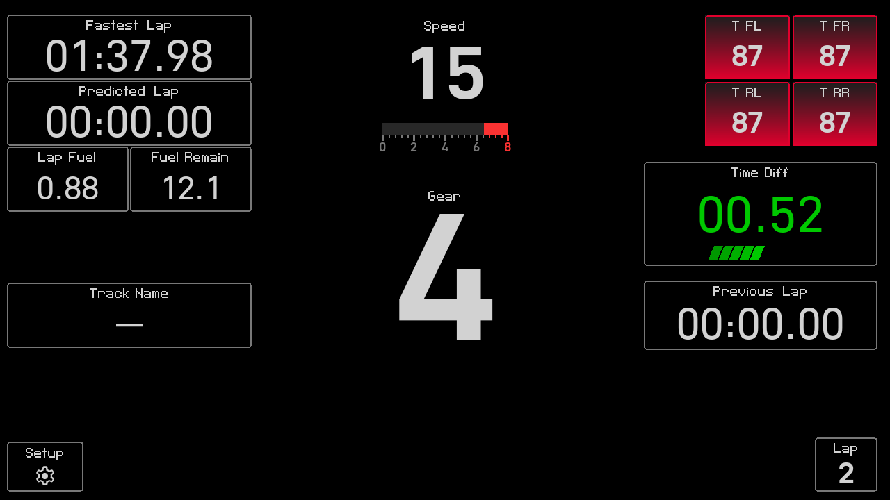
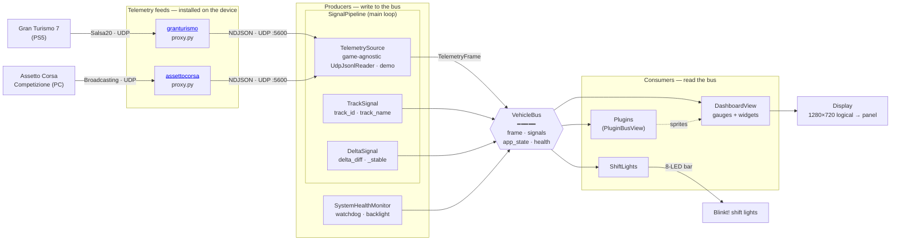

<div align="center">


# Revokyte

[](https://github.com/chrshdl/instrument-cluster-os/actions/workflows/ci.yml)
[](https://github.com/chrshdl/instrument-cluster-os/releases)
[](https://discord.gg/dEQJSuva7K)

</div>

## Why

Sim racing is at its best in the moments you forget it's a simulation. Nothing breaks that spell faster than instruments you can't trust — numbers you have to squint at, a delta that flickers, a dashboard that stutters exactly when the lap is on the line.

We believe every sim racer deserves what a real driver has: instruments worth betting a corner on. A dash you read in a half-second glance at full speed, that tells the truth, every lap. And we believe that experience should be **yours** — no account, no subscription, no data leaving your room. Open hardware, open source, owned outright.

## How

We build the way race engineers build, not the way app developers build:

- **Readable at speed.** Every gauge is designed for the half-second glance: big, high-contrast, following professional motorsport dashboard conventions — green when ahead, red when behind, trend dashes showing magnitude.
- **Stable by design.** A real-time 60 fps loop that never pauses for menus, and a sample-and-hold filter with hysteresis so the delta digits hold still long enough to actually read.
- **Honest about data.** Track identification never guesses — it shows `---` until the evidence is conclusive. Gauges a game can't feed simply stay dark instead of pretending.
- **Owned, not rented.** Fully offline, GPL-licensed, running on a Raspberry Pi you bought once. The core is game-agnostic, so no single title — and no vendor — can hold your dashboard hostage.

## What

The result is an embedded sim racing instrument cluster, built with Python and pygame. It receives live telemetry from Gran Turismo 7 or Assetto Corsa Competizione over UDP and renders a real-time dashboard at 60 fps.

Support for each game comes from a small, separately-released _feed program_ that reads the game's telemetry and re-emits it as NDJSON to the cluster (GT7 via the [granturismo](https://github.com/chrshdl/granturismo) proxy; ACC via its native Broadcasting API). You pick a game in the settings and the device installs the matching feed — the cluster itself stays game-agnostic. ACC's Broadcasting API doesn't expose engine RPM, tyre temperatures, or fuel, so those gauges are inactive in ACC mode.

It runs on a Raspberry Pi 4 or 5 with a 720×1280 touch display — or as a [desktop app](#desktop-app-windows--macos) on Windows and macOS, where GT7 telemetry is read straight from the console with no extra programs.

<div align="center">

[](https://www.youtube.com/watch?v=VLkjhCFHSfc)

</div>

**Telemetry & gauges**

- Vehicle speed and gear indicator
- Graphical RPM with torque-based shift lights
- Per-tire temperatures

**Driver coaching**

- Live delta vs. reference lap, updated in real time
- Best, previous, and predicted lap times
- Automatic track identification from GT7 position data (ACC reports the track name directly)

## Desktop app (Windows / macOS)

Grab the latest build from [Releases](https://github.com/chrshdl/revokyte/releases): `Revokyte-<version>-windows-x64.exe` on Windows, `Revokyte-<version>-macos-arm64.zip` (unzip → `Revokyte.app`) on Apple Silicon Macs — `-macos-x86_64.zip` on Intel Macs — or `Revokyte-<version>-linux-x86_64.tar.gz` on Linux (`tar xzf`, then run `./Revokyte`; needs a glibc at least as new as the latest Ubuntu LTS).

The builds are **unsigned**, so the first launch needs one extra click:

- **Windows** — SmartScreen shows *"Windows protected your PC"*: click **More info → Run anyway**. The first time you connect to a console, allow the app through the Windows Firewall prompt (it receives UDP telemetry from your PS5).
- **macOS** — Gatekeeper shows *"Apple could not verify Revokyte is free of malware"*: click **Done** (not Move to Bin!), then open **System Settings → Privacy & Security**, scroll down to the Revokyte message and click **Open Anyway** (needed once). Terminal alternative: `xattr -dr com.apple.quarantine ~/Downloads/Revokyte.app`. On macOS 14 and older, right-click → Open works instead.

Half the sim-racing tool ecosystem ships this way; the source these builds come from is right here.

The app starts in demo mode. For live telemetry, tap **Setup**, choose **Gran Turismo 7**, and enter your PlayStation's IP — the app then decrypts the console's telemetry stream in-process; unlike the appliance there is no feed program to install. The window is resizable (the dash scales to fit, aspect preserved).

## Quick start

The project uses [`uv`](https://docs.astral.sh/uv/#installation) for dependencies and the virtual environment. From the repo root:

```bash
uv venv
source .venv/bin/activate   # Windows: .venv\Scripts\activate
uv sync

python -m instrument_cluster
```

This launches in **demo mode**, replaying a recorded session — no PlayStation required. For live telemetry, pick **Gran Turismo 7** in the settings UI and enter your console's IP (dev machines behave like the desktop app: the stream is read in-process via [granturismo](https://github.com/chrshdl/granturismo), installed by `uv sync`). On the appliance the same menu instead installs the game's feed program and listens for its NDJSON in UDP mode.

Configuration lives at `~/.config/instrument-cluster/config.json` (override with the `IC_CONFIG_PATH` environment variable).

### Tests

```bash
uv run pytest                  # full suite
uv run pytest --cov=instrument_cluster
```

## Architecture

At the center is the **`VehicleBus`** — a shared blackboard holding the latest `frame`, computed `signals`, UI `app_state`, and a `health` monitor. A 60 fps main loop (`main.py`) orchestrates everything: producers write to the bus, consumers read from it.



How the pieces fit together:

- **`TelemetrySource`** wraps the active reader — `DemoReader` (replays a recorded session), `UdpJsonlReader` (NDJSON on `127.0.0.1:5600`), or, on desktop, a feed's in-process reader (`Gt7DirectReader` runs the granturismo `Feed` on a background thread and maps each packet to a `TelemetryFrame` — the proxy's data path without the separate process). The UDP reader is game-agnostic: it consumes whatever feed program is installed (`src/instrument_cluster/addons/feeds.py` lists them — the [granturismo](https://github.com/chrshdl/granturismo) proxy for GT7, an ACC Broadcasting feed for ACC), each of which emits the same `TelemetryFrame` schema. Readers run on a background thread; the loop pulls the newest frame each tick.
- **Signal processors** (`signals/`) enrich the frame before the UI sees it. `TrackSignal`, `DeltaSignal`, `FuelSignal`, `LinkSignal`, and `TelemetrySource` are bundled in `SignalPipeline`, which runs in the main loop alongside the health monitor — so telemetry processing continues uninterrupted even when settings menus are open. Each processor returns a dict merged into `VehicleBus.signals`.
- **`LinkSignal`** supervises the telemetry link. Readers hold their last frame indefinitely, so without it a sleeping console, a crashed feed or a dropped Wi-Fi link would leave the gauges showing the last speed and gear forever, indistinguishable from live data. It publishes `telemetry_stale`, which drives `NoSignalWindow` — a SYSTEM_ALERT overlay window (see Window Layering) that raises a full-width **NO SIGNAL** banner across the band above the footer. The gauges keep their last values at full brightness; the banner is what says they are no longer live.
- **`StateManager`** maintains a *stack* of UI states (dashboard, setup, IP entry, …). Pushing a state pauses the one below; popping resumes it. Rendering uses dirty-rect updates.
- **`Display`** presents the fixed 1280×720 logical surface to the physical panel — GPU-rotated 270° on the Raspberry Pi Display 2, scaled on the Waveshare 7″, or stretched into the resizable desktop window (pygame `SCALED`, aspect preserved).

### Adding another game

The app is game-agnostic — it only ever reads `TelemetryFrame`-shaped NDJSON on `udp://127.0.0.1:5600`. Supporting a new game means writing a **feed program** that produces that NDJSON and adding a one-line **registry entry** so the device can install it — then shipping it in an image. There are **no per-game code paths** to add.

1. **Build a feed program** in its own repo, mirroring [granturismo](https://github.com/chrshdl/granturismo) (GT7) or [assettocorsa](https://github.com/chrshdl/assettocorsa) (ACC). It reads the game's telemetry and re-emits it as NDJSON to `udp://127.0.0.1:5600`, using field names that match `TelemetryFrame` (`src/instrument_cluster/telemetry/models.py`). Populate whatever the game exposes (speed, gear, lap times, position, …) and leave the rest at their defaults — missing channels such as RPM, tyre temps, or fuel simply leave those gauges inactive. You do not need to set `received_time`: the cluster stamps it on arrival, because it is the freshness clock the delta, fuel and link-supervision signals all gate on and it has to come from the receiving side to be trustworthy. If the game provides its own delta or track name, set the optional `native_delta_ms` / `track_name` fields and `DeltaSignal` / `TrackSignal` republish them; otherwise they fall back to position-based computation (which needs the GT7-style track database). Ship it as a **signed, self-contained tarball** on GitHub Releases (a `proxy-wrapper.py` launcher plus the package), reusing granturismo's `build_tarball.py` / `sign_artifact.py` and release workflow.

2. **Register the feed** — add one `FeedDescriptor` to `FEEDS` in `src/instrument_cluster/addons/feeds.py`:
   - `id` / `label` — persisted key and settings-dropdown text
   - `github_repo` / `asset_prefix` — where the installer fetches the latest signed release
   - `signing_pubkey_b64` — the Ed25519 public key matching your release-signing key
   - `ip_prompt_title` — title of the IP-entry screen
   - `env_builder` — builds the env-file body your proxy reads (variable names must match what your proxy expects)
   - `install_name` (optional) — install subdirectory under `/opt/telemetry`, defaults to `id`

The settings dropdown, IP-entry flow, and installer all work off the descriptor — no per-game code beyond the two steps above.

3. **Ship it via [instrument-cluster-os](https://github.com/chrshdl/instrument-cluster-os).** A standard feed needs **no rootfs/systemd change**: the proxy service (`instrument-cluster-proxy.service`) already runs `/opt/telemetry/active/proxy-wrapper.py` and loads its config from `/data/etc/instrument-cluster-proxy`, so on install the device fetches and verifies your release into `/opt/telemetry/<install_name>`, points `/opt/telemetry/active` at it, and restarts the proxy. But because the feed **descriptor** is compiled into the app, the new game reaches devices only through an image release: tagging the app (`v*`) auto-bumps the app version pin in `package/python-instrument-cluster/python-instrument-cluster.mk`, after which you tag `instrument-cluster-os` (`v*`) to build a fresh image to flash. (Later *feed* releases need no image rebuild — the tarball is fetched at runtime with no pin.) The only reason to touch the OS repo directly is if your feed needs something the base image lacks — an extra system package, a non-stdlib runtime, or a different install root — in which case update the Buildroot config / rootfs overlay accordingly.

### Plugins

Drop a file in `src/instrument_cluster/plugins/` that extends `GenericPlugin` (from `core/plugin_system/sdk.py`). It receives a reference to the `VehicleBus`, implements `setup()` and `update(dt)`, and reads data via `self.get_signal(key)`.

### Debugging in VS Code

Create a `launch.json` in the **Run and Debug** view:

```json
{
    "version": "0.2.0",
    "configurations": [{
        "name": "Python Debugger: Current File",
        "type": "debugpy",
        "request": "launch",
        "module": "instrument_cluster.main",
        "cwd": "${workspaceFolder}",
        "env": {
            "PYTHONPATH": "${workspaceFolder}/src"
        },
        "console": "integratedTerminal"
    }]
}
```

Press F5 to start debugging.

## Hardware

| Component | Supported |
|-----------|-----------|
| Board     | Raspberry Pi 4 Model B (1 GB RAM, built-in Wi-Fi) |
| Display   | Raspberry Pi Touch Display 2 — 720×1280, 24-bit RGB, five-finger touch |
| LEDs      | Pimoroni Blinkt! 8-LED bar (shift lights) |
| Input     | Touch UI + on-screen brightness keys |

### Standalone image

For a turnkey setup that boots straight into the dash, download the prebuilt Raspberry Pi image from the [instrument-cluster-os releases](https://github.com/chrshdl/instrument-cluster-os/releases) and flash it to an SD card (e.g. with Raspberry Pi Imager).

[](https://github.com/chrshdl/instrument-cluster-os/releases)

## Legal

This project is created for educational and personal use and provided without warranty of any kind, express or implied. Use at your own risk.

All trademarks, logos, and brand names are the property of their respective owners. *Gran Turismo*, *Gran Turismo 7*, *GT7*, and *PlayStation* are trademarks or registered trademarks of *Sony Interactive Entertainment Inc.* and *Polyphony Digital Inc.* *Assetto Corsa Competizione* and *ACC* are trademarks or registered trademarks of *Kunos Simulazioni S.r.l.* This project is independent and not affiliated with or endorsed by any of them.

## License

All application code is licensed under the **GNU General Public License v3.0 or later** (GPL-3.0-or-later) — full text in [`LICENSE`](LICENSE). Copyright (c) 2025-2026 christian hedel. Bundled libraries follow their respective licenses.

The track database `src/instrument_cluster/db/tracks.json` is derived from community-collected GPL-3.0 data and is distributed under the same license as the code; see [`src/instrument_cluster/db/NOTICE.md`](src/instrument_cluster/db/NOTICE.md) for its provenance. The vendored delta calculator (`core/delta_calculator/`) is the author's own work from the separate delta-calculator repository, relicensed here under the same terms.

Desktop releases additionally ship a `legal-info-<version>-<platform>.tar.gz` next to each binary — the license manifest and full license texts for everything bundled inside it, mirroring the legal-info bundle the OS image releases ship.

**Proprietary add-ons are not part of this repository**: they are developed separately and ship in their own OS image. This codebase only contains the generic plugin and extension interfaces they plug into.

Contributions are accepted under a CLA — see [`CONTRIBUTING.md`](CONTRIBUTING.md).

## Credits

Track identification is only possible thanks to data collected by the GT7 telemetry community:

- [**Bornhall/gt7telemetry**](https://github.com/Bornhall/gt7telemetry) (GPL-3.0) — start/finish gates, crossing directions, and bounding boxes for every layout (`gt7trackdetect.csv`).
- [**ddm999/gt7info**](https://github.com/ddm999/gt7info) (MIT-0) — course IDs and display names (`course.csv`).
- [**Nenkai**](https://github.com/Nenkai) and the [GTPlanet](https://www.gtplanet.net/) community — reverse-engineering of the GT7 telemetry protocol that all of the above builds on.
